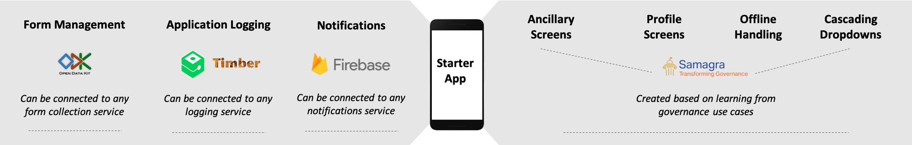
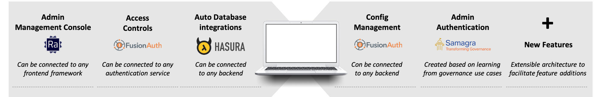
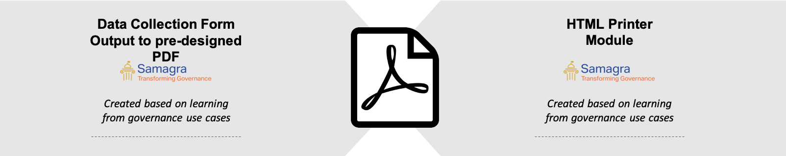
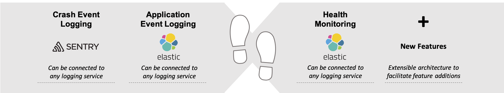

# Components Overview

## Introduction

Samagra has been working closely with state governments to solve complex governance problem statements, majority of which are enabled by technology interventions. Through our experience we have observed that there is a significant opportunity to democratise the process of building and reusing technology products for governments using OpenSource libraries, leading to savings for the governments in both, cost and time.

To democratise product development for governments, we began a journey to abstract governance use cases, identify opensource libraries that can be wired together to create products for these use cases, collaborate with state governments to sensitize them about governance focussed product life cycles and finally deployed opensource products at scale.If you are a bureaucrat looking to leverage technology for your department this section will help you understand how you can kickstart or streamline certain department initiatives using opensource reusable technology.If you are an engineer from the National Informatics Centre or an engineer from a private agency working with the governments, this section will help you understand how to build technology products using opensource libraries in a scalable, extensible and reusable way.

As a starting point, while working with different state governments, we abstract different use cases across a particular sector. With these use cases we create product requirements and then identify different opensource libraries that can be used to build these products. Over the past 12 months we have wired together and deployed products at scale for different departments across multiple states. To increase the adoption of these products we have packaged them together as sector specific toolkits.

**Each product is created by wiring together different opensource libraries.** Once we wire together products we document how each library works together. The objective is to enable state engineering teams to directly be able to set these products up themselves. **A group of opensource libraries when wired together to create product features are called technology components.** Therefore, each technology component is a set of opensource libraries wired together for enabling a feature in the application. An overview of the different components is provided below

## [Mobile Application (Android) Component](https://samagra-development.github.io/docs/docs/COMobileApplication)

Setup a mobile application with governance specific feature set such as data collection forms, externally linked metadata, in-app notifications, offline handling and more.

## [Application Control](https://samagra-development.github.io/docs/docs/COAppControl)

Setup an application control management console to manage application metadata with the ability to manage application user authentication and in-app metadata configurations.

## [PDF Generator](https://samagra-development.github.io/docs/docs/COPDFGenerator)

Setup a mechanism to generate PDFs using a configurable Google doc design with input parameters from any linked database using an API based method.

## [Data Analytics](https://samagra-development.github.io/docs/docs/CODataAnalytics)

Setup a communication engine that enable you to create business rules based on incoming data and trigger notifications to the end users of your applications.

## [Application Logging](https://samagra-development.github.io/docs/docs/COApplicationLogging)

Setup a logging mechanism to track the health of your application understand application performance and crash events to make informed improvements in your product.

## [Database Management](https://samagra-development.github.io/docs/docs/CODatabaseManagement)

Setup your database management to monitor database clusters, send alerts to DevOps, change database configs on the fly and manage a highly scalable database.

