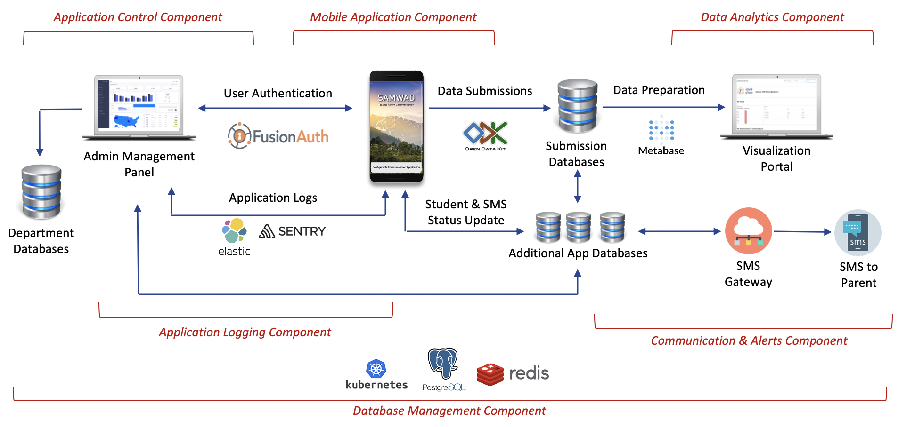

## 1. Introduction

Improving the quality and timeliness of engagement between teachers and parents of students has been a priority for school management systems across the globe. While private schools continue to invest capital into this process by creating school focussed mobile and web applications, there remains a large scope of improving this within the government ecosystem. However, given the economic background of parents of majority of the government school children, who have older versions of Android mobile phones with limited connectivity and therefore have limited engagement with their mobile devices.

With this backdrop, a simple SMS based communication product was envisioned for the State Education Department in Himachal Pradesh. It was named Samwad and it is engineered in a manner that it can be leveraged by any State Education Department to decentralize SMS based communication between teachers and parents in a structured manner.

The objective of Samwad is to transform the process of communication with parents. Samwad has been technically designed with the assumption that the engineering team of the State National Informatics Centre or from a private technology firm working with the State Education Departments will be able to deploy and maintain this product with the documentation provided.

Through Samwad the State Education Department can have a mobile application with configurable SMS templates. This application can be used by all government school teachers in primary and secondary schools to send personalized template based SMS to parents. Management of users of this application, configuration of SMS templates, visualization of the data collected and tracking of the application performance can all be managed within this application by non-technical functional owners within the State Education Department.

## 2. Samwad Overview

### 2.1 Governance Use Cases

The Samwad product can be used for sharing the following updates by the State Education Department to the parents of the children enrolled in government schools:

1. Send daily attendance information
2. Send upcoming school holiday start and end date notification
3. Send upcoming parent teacher meeting
4. Send homework completion status about a child 
5. Send notification of an upcoming School Management Committee meeting 
6. Send assessment information of any summative or formative assessments
7. Send subjectwise and gradewise practice questions daily or weekly to parents
8. Send guidance or alerts during natural disasters (floods, cyclones, medical emergency such as Covid-19)
9. Send school infrastructure upgrade updates
10. Share mid-day meal information

### 2.2 Usage Status Across India

Samwad is being used by the State Education Departments in Himachal Pradesh.

Total usage of the Samwad product as on 12 April 2020 is summarized below:

1. Total active users >20,400
2. Total SMSes sent > 1,25,000

### 2.3 Key Benefits

We have observed the following key benefits that the states using Samwad have experienced.

**_2.3.1 Improved timeliness of communication_**

Parents are updated about school activities in a timely manner thereby increasing accountability within the entire ecosystem of parents, teachers and school management for student focussed outcomes. 

**_2.3.2 Improved precision of communication_**

Personalized messages using structured SMS templates has allowed the school management system to send precise communication to parents, thereby increasing the consistentcy and clarity of communication with parents.

**_2.3.3 Increased monitoring coverage_**

In Haryana mentoring and monitoring exercises were limited to primary schools and after continued use of Samiksha for primary school monitoring, the State Education Department expanded these visits for secondary schools as well.

**_2.3.4 Higher coverage of parents_**

Through this mechanism all parents who may be busy with farming activities or do not have smartphones can be reached and updated about the student's school related activities. 

### 2.4 Typical Existing Alternatives

There are existing alternative processes that can be used for conducting these monitoring visits. These have been summarized below:

**_2.4.1 Updates during Parent Teacher meetings_**

Majority of the feedback given to parents is given during the parent teacher meetings in the school. These meetings are used to share abstracted feedback for the session with the parents of the children. However, given the low frequnecy of these meetings regular high freuquency updates such as attendance or homework status cannot be shared precisely through this channel in a pro-active manner.

**_2.4.2 Visit or call parents of the children_**

Often teachers may resort to visiting the parents of the children to provide feedback. However, given the daily schedule of the teachers, it becomes hard and often not feasible for teachers to visit parents to give them regular feedback about the children, especially for sharing attendance information. This method is typically used only when the issue is extremely serious.

### 2.5 Core Features

**_2.5.1 For State Government School Teachers_**

- Manage student addressbook (with basic details of the students)
- Ability to view all SMS templates that can be sent to parents
- Ability to send personalized SMS to parents based on pre-existing SMS templates
- Ability to view the state of SMS sent
- Ability to update their own profile information

**_2.5.2 For State Department Officials_**

- Ability to view, in real time, complete details or summarized views of the different types of SMS sent by school teachers
- Ability to view, in real time, complete details or summarized views of the status of the SMS sent by school teachers
- Ability to view, in real time, details of the student addressbook

**_2.5.3 For Process Administrators_**

- Ability to create and manage SMS templates
- Ability to create and manage student profile variables
- Ability to create and manage school teacher profiles
- Ability to create visualizations of the visit submissions
- Ability to view application performance statistics

### 2.6 Technical Architecture

Samwad is wired together using the _[Mobile Application Component](www.google.com), [App Metadata Management Component](www.google.com), [Database Management Component](www.google.com), [Data Analytics Component](www.google.com), [Application Logging Component](www.google.com) & [Communication & Alerts Component](www.google.com)_. The following diagram illustrates the technical architecture of the Samwad product.

## 3. High Level Specifications

### 3.1 Simple User Flow For Sending SMS

**_3.1.1 Configurable SMS templates_**

SMS templates can be defined and updated. Each SMS template is linked to a form that the teacher updates. Attendance form has pre-filled student data, teacher marks the absent students and in one click triggers the SMS to the parent. For Holiday announcement the teacher selects the start and end date and then triggers the SMS.

**_3.1.2 Seamless Integration with Govt SMS Providers_**

Once the SMS is generated it can be sent using any government or private SMS provider. For instance, Centre for Development of Advanced Computing Centre in Mumbai is a government agency that provides SMS facility for all government organisations and has an active integration with the Samwad application in Himachal Pradesh.

**_3.1.3 Offline Enabled_**

SMS can be triggered by the teacher even if there is no network connectivity. These SMSes will be sent forward for distribution to the concerned parents once the teacher is connected back online. The teacher will be notified about both, that there is no internet connectivity at the moment and when the SMSes are sent forward once online.

**_3.1.4 Summary of SMS Sent_**

A clear summary of each type of SMS sent is provided to the teacher to provide visibility of the SMS status. The teacher will be provided information regarding the total SMS sent, pending or failed, including the names of the students for which they are pending.

### 3.2 Configurable Mobile Application

**_3.2.1 Whitelabel UI_**

Whitelabel the mobile application by adding the theme colors, splash screens, login screens, logos, about us information based on your department branding.

**_3.2.2 Add / Remove Pages_**

Add custom pages within the application to share information with the users about the purpose of the application, tutorial videos regarding how to ‘Send an SMS’, helpline numbers, and instructions.

**_3.2.3 Jurisdiction Data_**

Update jurisdiction data consisting of districts, blocks, cluster, GPs, schools and more live from the backend. If a new school, GP or cluster is added it can be made live immediately.

**_3.2.4 New SMS Updates_**

New types of SMS can be remotely added on the application. Once the user comes online the new SMS templates and the related forms to trigger the SMS would be automatically updated on the user’s application.

_A configurable mobile application can be setup by deploying the Samwad application. Refer to this [Section](www.google.com) to deploy the application yourself. Once the applicaton is installed you can further read about how to customize [Ancillary Screens](www.google.com), update [Jurisdiction Data](www.google.com) and setup [Notifications](www.google.com)._

### 3.3 User Authentication & Management

_admin console images to be added as GIFs_

**_3.3.1 User Management_**

Create and manage users through a pre-designed admin panel and add variables for each user, who in this case would typically be the teachers of the government schools. In addition, if this data needs to be pulled from the state HR systems then the same is also facilitated in the application.

**_3.3.2 Role / School Based SMS Access_**

Enable or disable access to SMS templates based on the school. If SMSes need to be sent to parents for a particular initiative that is being conducted in select schools then new SMS templates and related forms can be added to the application remotely and made visible only for that specific set of schools.

**_3.3.3 View Profile Details (in App)_**

Allow users to view or edit specific variables of their profile information through the mobile application itself. Often latest contact numbers for all teachers are not available so user can update that through the application.

**_3.3.4 OTP Based Password Reset_**

Users can reset their passwords though an SMS based password reset functionality. If user credentials are created for a school then if a school head teacher is transferred then the new head teacher can update his/her details seamlessly.

_A details for setting up the User Authentication & Management Console are available [here](deploysamiksha.md)._

### 3.4 Visualize Form Information

**_3.4.1 Easy to Configure Graphs_**

Create visualizations with a few clicks using Metabase, a configurable visualization tool with detailed documentation

**_3.4.2 Filtered Views_**

Add filters to graphs to show data grouped by any variable in your dataset. Typically used for grouping by school, cluster, block, district, academic year.

**_3.4.3 Add Images & Logos_**

Insert government state education department logos and local on-ground images across dashboards to make them look consistent to the state department branding.

**_3.4.4 Generate PDF Views_**

Configure PDFs for dashboard views to enable users to download and print different views of the dashboard. This is typically used by block officers to put up monthly dashboard based report on notice boards in their offices or by teachers in schools.

### 3.5 Monitor Application Performance

**_3.5.1 Track User Engagement_**

Track user engagement at a per minute, per 30 minutes, per 24 hours to understand peak engagement period of the application

**_3.5.2 Track Crash Events_**

Track any crash events with a detailed log of the user activity to debug any issue that the user is facing on the ground

**_3.5.3 Setup Monitoring Alerts_**

Setup email alerts for different monitoring objectives such as new type of crash event observed, CPU usage >75%, disk space >80% and more

**_3.5.4 Visualize Monitoring Data_**

Visualize all application events to understand trends of usage behaviour of your application through a single view

## 4. For Administrators (How-To-Configure Guides)

### 4.1 Configure SMS Templates

Samwad SMS - For school teachers to send an SMS the teachers will have to fill a form to indicate the details for which an SMS has to be sent. For example, 

1. If the teacher wants to send an SMS for updating parents about the upcoming holidays, then the teacher would have to fill a basic form to update the start date, end date and the number of days of the holidays. This information will be combined together as an SMS and then sent forward to the respective parents. 

2. If a teacher wants to send a SMS to indicate the children who were absent in the class today then the teacher would select the children using a form and then the same is submitted and converted into single SMSes.

These basic forms can are configured using [Open Data Kit](https://opendatakit.org). The Open Data Kit software is an open source software that allows for collecting, managing, and using data in resource-constrained environments. It allows for the collection of data offline and submission of the data when internet connectivity is available. It allows users to aggregate data with full control over the collected data and the servers where this data is stored.

A pre-requisite for configuring and updating the forms in your application is to [setup](deploysamwad.md) the Samwad application.

A summary of the steps to create a data collection form using ODK has been provided below.

**_4.1.1 Create a form using ODK Build_**

To start, you can create a form using ODK Build. ODK Build is a form designer with a drag-and-drop user interface that has been provided by ODK. View the documentation of how to use ODK Build to create a form [here](https://docs.opendatakit.org/build-intro/).

**_4.1.2 Alternatively, create an ODK XLS form_**

In case you plan to create a data collection form which has inclusions of multiple form logic, expressions, validations and so on, then we would recommend you use the ODK XLS Form method to create this form. XLSForm is a form standard created to help simplify the authoring of forms in Excel. To get an overview of XLS Forms view the documentation [here](https://docs.opendatakit.org/xlsform/).

There are 3 mandatory sheets that need to be created in every excel form and each sheet as certain mandatory columns that need to be created within each sheet. The three mandatory sheets along with mandatory columns are as follows:

- _Survey:_ three mandatory columns under this sheet are type, name and label.
- _Choices:_ three mandatory columns under this sheet are list name, name and label.
- _Settings:_ two mandatory columns under this sheet are form_title and form_id.

_Some important rules:_

- The name of every sheet and column should be in lower case
- Name of the excel file cannot start with a number
- The name of the excel file cannot contain spaces

**Basic structure of the survey sheet**

This is the sheet which will contain most of the content of the form such as the questions, the question type, the appearance of the questions, the constraints etc.

- _Type column:_ enter the question type in this column.
- _Name column:_ give a unique name to each question, use lower case only and \_ (underscore) as a separator.
- _Label column:_ enter your question in this column.

Some additional useful columns are as follows:

- _Hint:_ Enter instructions related to the question in this column.
- _Required:_ If the question is mandatory, enter "yes" in this column.
- _Appearance:_ commands related to appearance of the question appear in this column.

**Basic structure of the choices sheet**

This sheet contains the choices of multiple choice questions

- _List name:_ Enter each of the list names that was created in the “survey” sheet.
- _Name:_ Give a unique name to each of your choices in the list.
- _Label:_ Enter each choice that will be visible to the user in this column.

**Basic Structure of the settings sheet:**

This sheet has variables that allow users to define the name of the form that will be shown to mobile application users

- _Form_title:_ Enter the title of the form that will be displayed to the user.
- _Form_id:_ Specifies the table name.

While creating an XLS there are several types of functions that you can enable in the data collection ranging from defining question types, setting up a form logic, defining form styling, and creating form operators. We have listed some of the commonly used features for each of these.

_Question Types_

ODK has a wide variety of [question types](https://docs.opendatakit.org/form-question-types/)

We have observed that the following question widgets are used extensively in Samwad.

- [Text widgets](https://docs.opendatakit.org/form-question-types/#text-widgetsv)
- [Number widgets](https://docs.opendatakit.org/form-question-types/#number-widgets)
- [Date and time widgets](https://docs.opendatakit.org/form-question-types/#date-and-time-widgets)
- [Select widgets](https://docs.opendatakit.org/form-question-types/#select-widgets)
- [Hidden questions](https://docs.opendatakit.org/form-question-types/#hidden-questions)
- [Grouping multiple widgets on same screen](https://docs.opendatakit.org/form-question-types/#grouping-multiple-widgets-on-the-same-screen)

_Form Logic_

ODK offers a mechanism of enabling dynamic behaviour in the data collection forms. The commonly used form logic that we have observed are indicated below.

- [Form logic building blocks](https://docs.opendatakit.org/form-logic/#form-logic-building-blocks)
- [Requiring responses](https://docs.opendatakit.org/form-logic/#requiring-responses)
- [Setting default responses](https://docs.opendatakit.org/form-logic/#setting-default-responses)
- [Validating and restricting responses](https://docs.opendatakit.org/form-logic/#validating-and-restricting-responses)
- [Conditionally showing questions](https://docs.opendatakit.org/form-logic/#conditionally-showing-questions)
- [Groups of questions](https://docs.opendatakit.org/form-logic/#groups-of-questions)

_Form Styling_

Form styling can be used to add media to the questions to change the fonts and colors of the questions in the data collection forms. This is a great way to add some color and make the data collection form UI more engaging for the end user. Read more about all the interesting updates that you can do the form styling [here](https://docs.opendatakit.org/form-styling/#markdown-in-forms)

You can also add Emojis to questions!

_Form Operators & Functions_

Form operators and functions allow users to setup calculations, constraints and validations for questions in the data collection forms. For example if you want to create questions based on the type of school then you can apply a 'Relevant' function that allows the monitor to view different questions based on the type of school (Primary, Secondary) the monitor is monitoring.

Form Operators are also important as they allow you to set up validations in the forms.

View the details of the different form operators [here](https://docs.opendatakit.org/form-operators-functions/#math-operators).

**_4.1.3 Convert this XLS Form to XML_**

Once the excel sheet is created and finalized convert it to XML using the [XLS to XML converter](https://opendatakit.org/xlsform/).

**_4.1.4 Upload the XML to the ODK Aggregate server_**

Once the XML is generated then you are ready to upload the form to your ODK Aggregate Server. Follow these steps mentioned below to update the form and view it in your mobile application:

- Sign with your designated credentials
- Add New Form through the Form Management Section

_Note: Forms with the same Form ID can only be uploaded if there no addition or deletion of questions_

**_4.1.5 Manage existing forms_**

- Form data can be viewed in the Submissions tab by filtering on the desired form
- All the form submission can be downloaded in a csv using the EXPORT function
- Entries in the submission data can be deleted by clicking on the cross button added on each row of the submission data
- You can view documentation about what more you can do on Aggregate [here](https://docs.opendatakit.org/aggregate-forms/)
- By removing a form from the Form Management page all submission data for that form will be DELETED
- As a thumb rule DO NOT DELETE any form from the Form Management page

**_4.1.6 Updating existing form_**

Certain changes which don't involve adding or removing a question can be made without needing to replace the existing forms. The kind of changes are:

- Changing the text or translation of a label
- Changing validations, calculations, relevants
- Changing options for a select_one or select_multiple
- Changing the order of questions
- Adding translations
- Updating media including CSVs for your form

Please view the [documentation](https://docs.opendatakit.org/form-update/) for updating existing forms as this will have an implication on how the database for this form is managed.

### 4.2 Manage Application Metadata

**_4.2.1 User Management_**

In Samwad, there is an admin console that can be enabled to allows administrators of the application at the state or district level to manage user authentication for the application. The typical feature set that is enabled through this admin console has been listed below.

- Addition of users
- View user information
- Edit details of existing users
- Delete users
- Reset password of existing users

The entire admin console is configurable. You can select what you want to see, how you want to see it (graph, table etc) and what you want to edit.

**_4.2.1 Metadata Management_**

In addition you can also update **_metadata_** of the application in this console. This application metadata would typically include the following details.

- School Details (School Name, UDISE, Type of School, Total Enrolment, GPS Coordinates etc)
- Administrative Location Mapping (District, Block, Cluster, GP etc)

### 4.3 Create Visualizations of SMS Summary Data

All the data collected through the Samwad application can be linked to Metabase to analyse data in the form of dashboards. [Metabase](https://metabase.com) is an Open Source tool for data visualization. It can be used to display any data in different formats like bar graphs, pie charts, tables etc. Metabase dashboards are simple to use and highly configurable. You can view this [Metabase documentation](https://www.metabase.com/docs/latest/users-guide/start.html) for how to setup basic graphs. A few key sections from this page that we typically refer to while building Metabase dashboards are listed below.

- [Overview of Metabase](https://www.metabase.com/docs/latest/users-guide/01-what-is-metabase.html)
- [Basics of Databases](https://www.metabase.com/docs/latest/users-guide/02-database-basics.html)
- [Basic Exploration in Metabase](https://www.metabase.com/docs/latest/users-guide/03-basic-exploration.html)
- [Asking questions in Metabase](https://www.metabase.com/docs/latest/users-guide/04-asking-questions.html)
- [Asking custom questions in Metabase](https://www.metabase.com/docs/latest/users-guide/start.html)
- [Using Metabase Visualizations](https://www.metabase.com/docs/latest/users-guide/05-visualizing-results.html)
- [Sharing and organizing your saved questions](https://www.metabase.com/docs/latest/users-guide/06-sharing-answers.html)
- [Creating dashboards](https://www.metabase.com/docs/latest/users-guide/07-dashboards.html)
- [Adding filters to dashboards](https://www.metabase.com/docs/latest/users-guide/08-dashboard-filters.html)

To view existing Metabase dashboards being used by different State Education Departments using Samiksha are available below:

- [Samarth ESamwad Dashboards](http://165.22.209.213:3000/public/dashboard/4a46427e-9d4d-4a3d-b33c-e7e14db0b5c1), Himachal Pradesh

## 5. Frequently Asked Questions

To be added based on comments recieved
